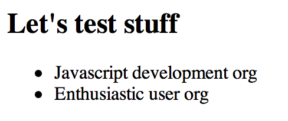
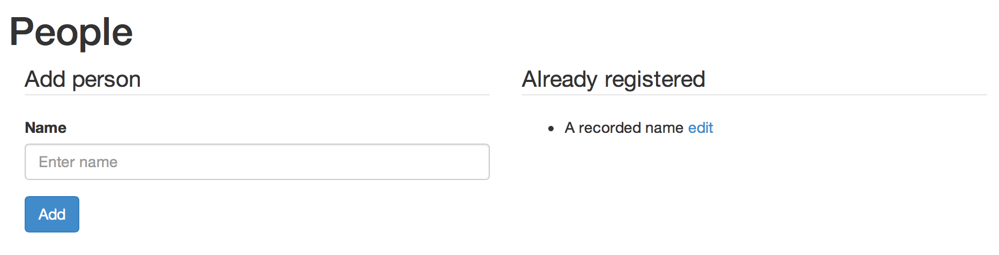

This tutorial
=============

Audience
--------
This tutorial is meant for Javascript and AngularJS beginners like me who already went
through the [official AngularJS tutorial](http://docs.angularjs.org/tutorial), and
preferrably, through the [AngularJS in one week end program](http://joelhooks.com/blog/2013/08/03/learn-angularjs-in-a-weekend/).
For this tutorial you will need a browser, a text editor and a git client.

Objective
---------
My personal objective when writing this tutorial was to see how AngularJS can be used to write a simple form. As we know, even for the most simple data model, you will depend on a dictionary of some sort:
* it could be a list of countries
* or some other sort of data with a very high number of items

Typically, a dropdown list is used when the number of items is small. For large lists,
you will have to search for your data. This is the *topic of this tutorial*: to explore how a search "widget" embeddable in a simple form can be implemented with AngularJS.


First step
==========
All the necessary code is provided below to complete this tutorial.
Alternatively, you can retrieve it from Github. Using your git client, get this tutorial with

    git clone https://github.com/adelinor/angular-data-picker-tutorial.git

Afterwards, check out the branch *step01* to get the code for the completed first step:

    git checkout step01

In the first step, we setup a project folder, and three files: one for the HTML page, one
for the AngularJS code and one for a mock JSON message that simulates a call to the
backend.
```
     +
     |
     +- app/
     |   |
     |   +- index.html
     |   |
     |   +- js/
     |       |
     |       +- controllers.js
     |
     +- messages/
         |
         +- search-orgs.js
```

First we build a message that emulates the results returned by a backend implementation. The file *search-orgs.js* contains only two items:

```js
[
{
	"dn": "uniqueIdentifier=1000,dc=orgs",
	"displayName": "Javascript development org"
},
{
	"dn": "uniqueIdentifier=1001,dc=orgs",
	"displayName": "Enthusiastic user org"
}
]
```

Then we create the *index.html* page:

```html
<html lang="en" ng-app>
<head>
	<title>Picker</title>
	<meta name="viewport" content="width=device-width, initial-scale=1.0">
	<link rel="stylesheet" href="http://netdna.bootstrapcdn.com/bootstrap/3.0.0/css/bootstrap.min.css">
	<script src="https://ajax.googleapis.com/ajax/libs/angularjs/1.0.8/angular.min.js"></script>
	<script src="js/controllers.js"></script>
</head>

```

The head section links to the [Bootstrap CSS framework](http://getbootstrap.com) and to
AngularJS version 1.0.8.
The `html` tag contains the attribute `ng-app` to let AngularJS know that this HTML page contains an AngularJS application.

To test this setup, we want to display the data from search org message. We use
AngularJS's ng-repeat, so here is the rest of the *index.html* file:

```html
<body>
<h2>Let's test stuff</h2>
<p>
<ul ng-controller="OrgsListCtrl">
	<li ng-repeat="org in searchResults">
		{{org.displayName}}
	</li>
</ul>
</p>
</body>
</html>
```

A controller, OrgsListCtrl, is declared in the `ul` element. This allows to fetch data and
store in the `scope` to make it available. In the `li` we iterate through the search results using the `ng-repeat` directive.

In the file *controllers.js* file, the controller is written with a simple function
as shown in the
[Angular tutorial step 5](http://docs.angularjs.org/tutorial/step_05). We use the out of
the box `$http` service to invoke the search. The result of the search is stored in the scope under the name `searchResults`.
```js
function OrgsListCtrl($scope, $http) {
	$http.get('../messages/search-orgs.js').success(function(data) {
		$scope.searchResults = data;
	});
}
```

Now open the *index.html* page with your browser and you should see the list of
organisations displayed:

 .

Et voilà, that's it for the first step.

Second step
===========
We are now going to start developing a form for entering people. To keep it as simple
as possible, we only enter one free text field for a person in this step.

You can get the code that completes this step by checking out the branch *step02*:

    git checkout step02

So, let's start editing the file *index.html*.

Let's add a bit of padding around the page:
```html
<body style="padding: 1em;">
```

Let's remove all content that was there previously within the body tag and add
the HTML elements for the People editor.

We start with a title:
```html
<h1>People</h1>
```

We add the form container, the CSS class indicates to only use half of the width (6 columns out of 12):
```html
<form class="form col-xs-6" role="form">
</form>
```

Within the `form` element we add the input for the person:
```html
<fieldset>
	<legend>Add person</legend>
	<div class="form-group">
		<label class="control-label" for="personName">Name</label>
		<input type=text" class="form-control" id="personName" placeholder="Enter name">
	</div>
	<button type="submit" class="btn btn-primary">Add</button>
</fieldset>
```

At the same time we want to display the list of people who have been registered already
and provide a link to allow to edit an existing record.
For that purpose, we add a `div` container after the `</form>` closing tag. Its CSS class tells to occupy half of the display (6 columns out of 12):

```html
<div class="col-xs-6">
<fieldset>
	<legend>Already registered</legend>
	<ul>
		<li>A recorded name
			<a href="#">edit</a>
        </li>
</ul>
</fieldset>
</div>
```
This form which has no behaviour for the moment, renders as shown below:

 

Now let's add some basic behaviour: clicking "add" will register the person. Clicking "edit" will bring a popup to indicate what person is edited. All data is saved in memory.

With AngularJS, HTML elements with behaviour must be under the supervision of a controller.
To do so we add a `ng-controller` declaration in the body element:

```html
<body style="padding: 1em;" ng-controller="PeopleCtrl">
```

We also add a declaration on the text input for the person's name: this is to bind the input to the model. We give the attribute name of `personNameNG`.

```html
<input type=text" class="form-control" id="personName" placeholder="Enter name"
	ng-model="personNameNG">
```

When the form is submitted we want a person to be added so we add the `ng-submit`
declaration to the form element:

```html
<form ng-submit="addPerson()" class="form col-xs-6" role="form">
```

At the end of the file *controllers.js* we add a new controller and define the function
addPerson(). Please note that the function is defined in the object `$scope` which is
visible in child HTML elements of the ng-controller.

```js
function PeopleCtrl($scope, $http) {
	$scope.addPerson = function() {
		alert('You are adding a person with name=' + $scope.personNameNG);
	};
};
```

Test it now!! You should see a pop up when clicking on add.

We now add to the controller an array for the persons added. The
addPerson function is changed to push objects to that array:

```js
function PeopleCtrl($scope, $http) {
	$scope.people = [];

	$scope.addPerson = function() {
		var pos = $scope.people.length;
		$scope.people.push(
			{
				id: pos,
				name:$scope.personNameNG
			} );
		$scope.personNameNG = '';
	};
};
```

With this implementation, adding people does not provide feedback anywhere. We
now need to show the registered people. The `ng-repeat` declaration is used
in the *index.html* for that. The `li` element below: 

```html
	<li>A recorded name
		<a href="#">edit</a>
	</li>
```
is replaced with:

```html
	<li ng-repeat="p in people">
		{{p.name}} <a href="#">edit</a>
	</li>
```

To add behaviour to the edit link, we use a `ng-click` declaration on the hyperlink:

```html
<a ng-click="editById(p.id)" href="#">edit</a>
```

This will invoke the function editById and provide the id to edit as an argument.
This function needs to be added to the controller:

```js
$scope.editById = function(id) {
	alert('You want to edit person with ID=' + id);
}
```

And this concludes the second step :(

Third step
==========
We are now going to expand what was done in the previous step:
1. The form will bind to a person object instead of binding to an input field directly to avariable of type `String`.
2. We will add new fields to form
3. We will implement the edit behaviour to repopulate the form from existing data
4. The title of the form will show Edit in edit mode or Add when adding a new record

Form binds to one object
------------------------
We want to bind the entire form to an object called `person` which will be in the scope of the controller.
AngularJS allows to use a dotted notation in the `ng-model` attribute for binding to a
member of an object directly. We update the `ng-model` attribute in the the *index.html*
file from `ng-model="personNameNG"` to `ng-model="person.name"`. 

The implementation of the controller `PeopleCtrl` actually becomes simpler
```js
	//form binds directly to object $scope.person
	$scope.addPerson = function() {
		var pos = $scope.people.length;

		//Assign id
		$scope.person.id = pos;

		$scope.people.push( $scope.person );

		//Reset form data via the bound object
		$scope.person = {};
	};
};
```

Adding new fields to the form
-----------------------------
The beauty of binding the entire form to an object is that you can modify the form content
without having to modify the controller logic. We only need to update the *index.html*
file for adding the new form elements:
* workAddress : the work address details. This will be the subject of later steps
* tel : a simple String
* mail : a string for the e-mail address

```html
	<!-- Add this after the block for the personName -->
	<div class="form-group">
		<label for="workAddress">Company</label>
		<!-- No input yet -->
	</div>
	<div class="form-group">
		<label for="tel">Tel</label>
		<input type=text" class="form-control" id="tel"
			 placeholder="+44 123 456 789"
		     ng-model="person.tel">
	</div>
	<div class="form-group">
		<label for="mail">E-mail</label>
		<input type=text" class="form-control" id="mail"
			 placeholder="bertrand@studio.com"
		     ng-model="person.mail">
	</div>
```

Implement the edit
------------------
Clicking the edit link invokes the `editById` function in the scope which currently
only displays an alert message. 

Now we want this function to populate the form from an object. In reality this would
trigger a call to a backend to fetch the data to edit. Here we look for the object in
memory. For that reason, we make a copy as otherwise updates would take effect even
if the user does not click save.

```js
	$scope.editById = function(id) {
		var pList = $scope.people;
		var i=0, len=pList.length;
		var p = null, item = null;

		for (; p == null && i < len; i++) {
			item = pList[i];
			if (item.id === id) {
				//p = item;
				//We edit a copy
				p = angular.copy(item);
			}
		}
		$scope.person = p;
	}
```

You only assign a new object to the person variable in `$scope` and AngularJS
binds automatically to the form.

This is all good but when the user clicks "Add" a new object will be added as new.
We therefore need to adapt the `addPerson` function. We will check if the data has
an ID: if it has, we will interpret the submission as an Edit, otherwise as a Create.
This is the code of the amended function:

```js
	$scope.addPerson = function() {
		if (typeof $scope.person.id == 'undefined' ) {
			var pos = $scope.people.length;
			$scope.person.id = pos;
			$scope.people.push( $scope.person );

		} else {
			//Replace object in list
			var id = $scope.person.id;
			var pList = $scope.people;
			var i=0, len=pList.length, notReplaced = true;

			for (; notReplaced && i < len; i++) {
				if (pList[i].id === id) {
					pList[i] = $scope.person;
					notReplaced = false;
				}
			}
		}

		//Reset form data via the bound object
		$scope.person = {};
	};
```

Adapt labels to differiente between Edit and Create modes
---------------------------------------------------------
The form is now functional: it allows to add entries and edit exising ones. In terms
of usability it is not yet complete: the labels __Add person__, for the form, and
__Add__, for the submit button, are misleading in Edit mode.

For that we create a new file *labels.js* at the same level as *index.html*:

```
     +
     |
     +- app/
     |   |
     |   +- index.html
     |   |
     |   +- labels.js
     |   |
     |   +- js/
     |       |
     |       +- controllers.js
     |
     +- messages/
         |
         +- search-orgs.js
```
This file will store labels in a Javascript object literal (JSON). The content of the file
is:

```js
{
	"formTitle.create" : "Add person",
	"formTitle.edit" : "Edit person",
	"submitButton.create" : "Add",
	"submitButton.edit" : "Apply"
}
```

To distinguish what is mode in which the form is employed, we create a new variable
in the `$scope` for the form mode. Also we need to load the labels in the controller.
At the top of the `PeopleCtrl` we therefore add:


```js
	//Form is by default in create mode
	$scope.formMode = 'create';

	//Load labels
	$http.get('labels.js').success(function(data) {
		$scope.LABEL = data;
	});
```


At the end of the `$scope.addPerson` function, we reset the mode to 'create':
```js
	//Reset form data via the bound object
	$scope.person = {};
	$scope.formMode = 'create';
```

When entering the `editById` function we set the mode to edit:

The best way would be to use labels in an externalized resource
```js
	$scope.editById = function(id) {
		$scope.formMode = 'edit';
		// rest as before ...
```

To finish we need to update the *index.html* file to replace the hard coded labels by
expressions an access to the `LABEL` table based on the formMode:

```html
<fieldset>
	<legend>{{LABEL['formTitle.'+formMode]}}</legend>

	<!-- ... -->

	<button type="submit" class="btn btn-primary">{{LABEL['submitButton.'+ formMode]}}</button>
</fieldset>
```

And that concludes the third step :)
