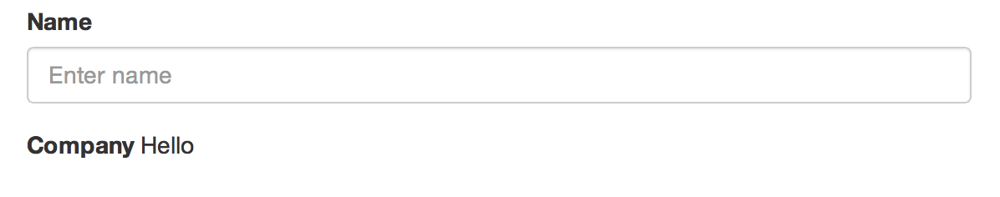
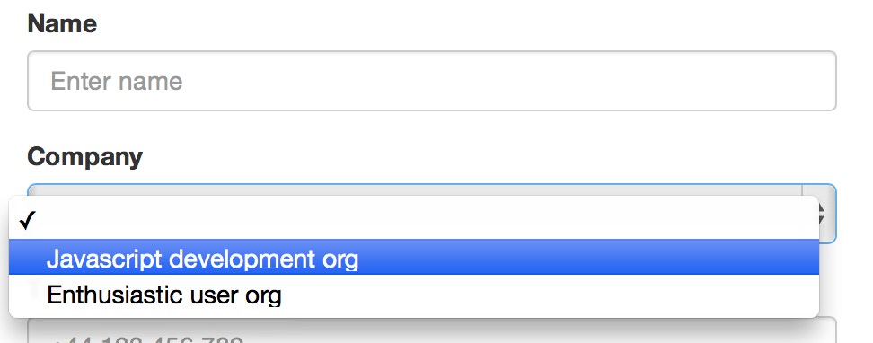
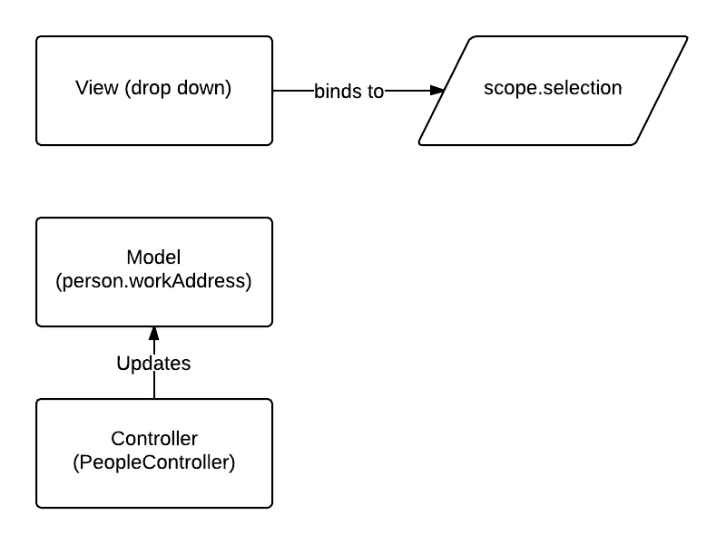
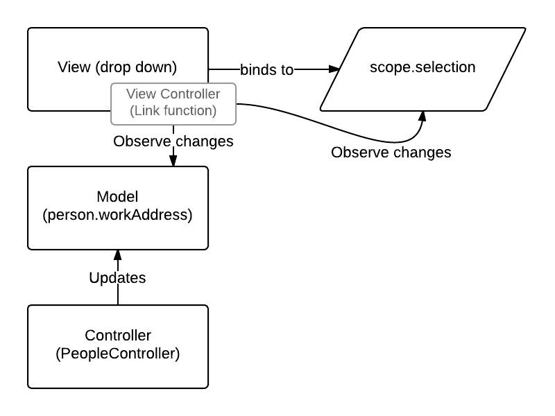
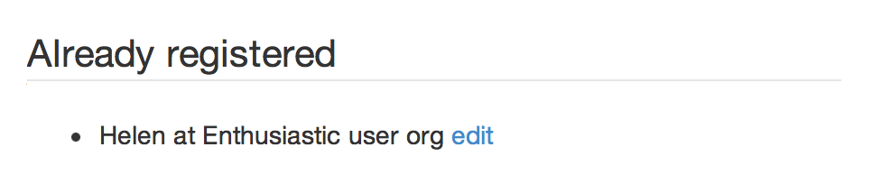
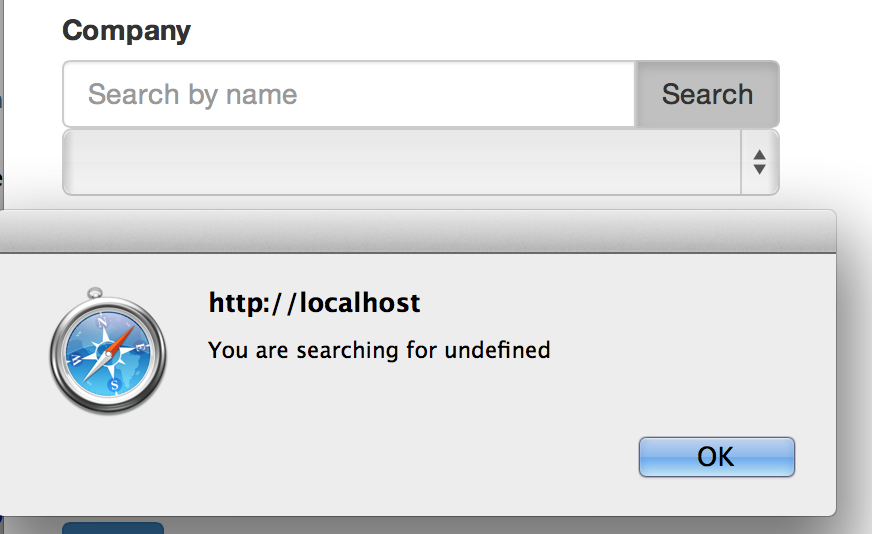

This tutorial
=============

Audience
--------
This tutorial is meant for Javascript and AngularJS beginners like me who already went
through the [official AngularJS tutorial](http://docs.angularjs.org/tutorial), and
preferrably, through the [AngularJS in one week end program](http://joelhooks.com/blog/2013/08/03/learn-angularjs-in-a-weekend/).
For this tutorial you will need a browser, a text editor and a git client.

Objective
---------
My personal objective when writing this tutorial was to see how AngularJS can be used to write a simple form. As we know, even for the most simple data model, you will depend on a dictionary of some sort:
* it could be a list of countries
* or some other sort of data with a very high number of items

Typically, a dropdown list is used when the number of items is small. For large lists,
you will have to search for your data. This is the *topic of this tutorial*: to explore how a search "widget" embeddable in a simple form can be implemented with AngularJS.


First step
==========
All the necessary code is provided below to complete this tutorial.
Alternatively, you can retrieve it from Github. Using your git client, get this tutorial with

    git clone https://github.com/adelinor/angular-data-picker-tutorial.git

Afterwards, check out the branch *step01* to get the code for the completed first step:

    git checkout step01

In the first step, we setup a project folder, and three files: one for the HTML page, one
for the AngularJS code and one for a mock JSON message that simulates a call to the
backend.
```
     +
     |
     +- app/
     |   |
     |   +- index.html
     |   |
     |   +- js/
     |       |
     |       +- controllers.js
     |
     +- messages/
         |
         +- search-orgs.js
```

First we build a message that emulates the results returned by a backend implementation. The file *search-orgs.js* contains only two items:

```js
[
{
	"dn": "uniqueIdentifier=1000,dc=orgs",
	"displayName": "Javascript development org"
},
{
	"dn": "uniqueIdentifier=1001,dc=orgs",
	"displayName": "Enthusiastic user org"
}
]
```

Then we create the *index.html* page:

```html
<html lang="en" ng-app>
<head>
	<title>Picker</title>
	<meta name="viewport" content="width=device-width, initial-scale=1.0">
	<link rel="stylesheet" href="http://netdna.bootstrapcdn.com/bootstrap/3.0.0/css/bootstrap.min.css">
	<script src="https://ajax.googleapis.com/ajax/libs/angularjs/1.0.8/angular.min.js"></script>
	<script src="js/controllers.js"></script>
</head>

```

The head section links to the [Bootstrap CSS framework](http://getbootstrap.com) and to
AngularJS version 1.0.8.
The `html` tag contains the attribute `ng-app` to let AngularJS know that this HTML page contains an AngularJS application.

To test this setup, we want to display the data from search org message. We use
AngularJS's ng-repeat, so here is the rest of the *index.html* file:

```html
<body>
<h2>Let's test stuff</h2>
<p>
<ul ng-controller="OrgsListCtrl">
	<li ng-repeat="org in searchResults">
		{{org.displayName}}
	</li>
</ul>
</p>
</body>
</html>
```

A controller, OrgsListCtrl, is declared in the `ul` element. This allows to fetch data and
store in the `scope` to make it available. In the `li` we iterate through the search results using the `ng-repeat` directive.

In the file *controllers.js* file, the controller is written with a simple function
as shown in the
[Angular tutorial step 5](http://docs.angularjs.org/tutorial/step_05). We use the out of
the box `$http` service to invoke the search. The result of the search is stored in the scope under the name `searchResults`.
```js
function OrgsListCtrl($scope, $http) {
	$http.get('../messages/search-orgs.js').success(function(data) {
		$scope.searchResults = data;
	});
}
```

Now open the *index.html* page with your browser and you should see the list of
organisations displayed:


Et voilà, that's it for the first step.

Second step
===========
We are now going to start developing a form for entering people. To keep it as simple
as possible, we only enter one free text field for a person in this step.

You can get the code that completes this step by checking out the branch *step02*:

    git checkout step02

So, let's start editing the file *index.html*.

Let's add a bit of padding around the page:
```html
<body style="padding: 1em;">
```

Let's remove all content that was there previously within the body tag and add
the HTML elements for the People editor.

We start with a title:
```html
<h1>People</h1>
```

We add the form container, the CSS class indicates to only use half of the width (6 columns out of 12):
```html
<form class="form col-xs-6" role="form">
</form>
```

Within the `form` element we add the input for the person:
```html
<fieldset>
	<legend>Add person</legend>
	<div class="form-group">
		<label class="control-label" for="personName">Name</label>
		<input type=text" class="form-control" id="personName" placeholder="Enter name">
	</div>
	<button type="submit" class="btn btn-primary">Add</button>
</fieldset>
```

At the same time we want to display the list of people who have been registered already
and provide a link to allow to edit an existing record.
For that purpose, we add a `div` container after the `</form>` closing tag. Its CSS class tells to occupy half of the display (6 columns out of 12):

```html
<div class="col-xs-6">
<fieldset>
	<legend>Already registered</legend>
	<ul>
		<li>A recorded name
			<a href="#">edit</a>
        </li>
</ul>
</fieldset>
</div>
```
This form which has no behaviour for the moment, renders as shown below:

 

Now let's add some basic behaviour: clicking "add" will register the person. Clicking "edit" will bring a popup to indicate what person is edited. All data is saved in memory.

With AngularJS, HTML elements with behaviour must be under the supervision of a controller.
To do so we add a `ng-controller` declaration in the body element:

```html
<body style="padding: 1em;" ng-controller="PeopleCtrl">
```

We also add a declaration on the text input for the person's name: this is to bind the input to the model. We give the attribute name of `personNameNG`.

```html
<input type=text" class="form-control" id="personName" placeholder="Enter name"
	ng-model="personNameNG">
```

When the form is submitted we want a person to be added so we add the `ng-submit`
declaration to the form element:

```html
<form ng-submit="addPerson()" class="form col-xs-6" role="form">
```

At the end of the file *controllers.js* we add a new controller and define the function
addPerson(). Please note that the function is defined in the object `$scope` which is
visible in child HTML elements of the ng-controller.

```js
function PeopleCtrl($scope, $http) {
	$scope.addPerson = function() {
		alert('You are adding a person with name=' + $scope.personNameNG);
	};
};
```

Test it now!! You should see a pop up when clicking on add.

We now add to the controller an array for the persons added. The
addPerson function is changed to push objects to that array:

```js
function PeopleCtrl($scope, $http) {
	$scope.people = [];

	$scope.addPerson = function() {
		var pos = $scope.people.length;
		$scope.people.push(
			{
				id: pos,
				name:$scope.personNameNG
			} );
		$scope.personNameNG = '';
	};
};
```

With this implementation, adding people does not provide feedback anywhere. We
now need to show the registered people. The `ng-repeat` declaration is used
in the *index.html* for that. The `li` element below: 

```html
	<li>A recorded name
		<a href="#">edit</a>
	</li>
```
is replaced with:

```html
	<li ng-repeat="p in people">
		{{p.name}} <a href="#">edit</a>
	</li>
```

To add behaviour to the edit link, we use a `ng-click` declaration on the hyperlink:

```html
<a ng-click="editById(p.id)" href="#">edit</a>
```

This will invoke the function editById and provide the id to edit as an argument.
This function needs to be added to the controller:

```js
$scope.editById = function(id) {
	alert('You want to edit person with ID=' + id);
}
```

And this concludes the second step :(

Third step
==========
We are now going to expand what was done in the previous step:

1. The form will bind to a person object instead of binding to an input field directly to avariable of type `String`.

2. We will add new fields to form

3. We will implement the edit behaviour to repopulate the form from existing data

4. The title of the form will show Edit in edit mode or Add when adding a new record

To view the code for the completed third step, run:

    git checkout step03 

Form binds to one object
------------------------
We want to bind the entire form to an object called `person` which will be in the scope of the controller.
AngularJS allows to use a dotted notation in the `ng-model` attribute for binding to a
member of an object directly. We update the `ng-model` attribute in the the *index.html*
file from `ng-model="personNameNG"` to `ng-model="person.name"`. 

The implementation of the controller `PeopleCtrl` actually becomes simpler
```js
	//form binds directly to object $scope.person
	$scope.addPerson = function() {
		var pos = $scope.people.length;

		//Assign id
		$scope.person.id = pos;

		$scope.people.push( $scope.person );

		//Reset form data via the bound object
		$scope.person = {};
	};
};
```

Adding new fields to the form
-----------------------------
The beauty of binding the entire form to an object is that you can modify the form content
without having to modify the controller logic. We only need to update the *index.html*
file for adding the new form elements:
* workAddress : the work address details. This will be the subject of later steps
* tel : a simple String
* mail : a string for the e-mail address

```html
	<!-- Add this after the block for the personName -->
	<div class="form-group">
		<label for="workAddress">Company</label>
		<!-- No input yet -->
	</div>
	<div class="form-group">
		<label for="tel">Tel</label>
		<input type=text" class="form-control" id="tel"
			 placeholder="+44 123 456 789"
		     ng-model="person.tel">
	</div>
	<div class="form-group">
		<label for="mail">E-mail</label>
		<input type=text" class="form-control" id="mail"
			 placeholder="bertrand@studio.com"
		     ng-model="person.mail">
	</div>
```

Implement the edit
------------------
Clicking the edit link invokes the `editById` function in the scope which currently
only displays an alert message. 

Now we want this function to populate the form from an object. In reality this would
trigger a call to a backend to fetch the data to edit. Here we look for the object in
memory. For that reason, we make a copy as otherwise updates would take effect even
if the user does not click save.

```js
	$scope.editById = function(id) {
		var pList = $scope.people;
		var i=0, len=pList.length;
		var p = null, item = null;

		for (; p == null && i < len; i++) {
			item = pList[i];
			if (item.id === id) {
				//p = item;
				//We edit a copy
				p = angular.copy(item);
			}
		}
		$scope.person = p;
	}
```

You only assign a new object to the person variable in `$scope` and AngularJS
binds automatically to the form.

This is all good but when the user clicks "Add" a new object will be added as new.
We therefore need to adapt the `addPerson` function. We will check if the data has
an ID: if it has, we will interpret the submission as an Edit, otherwise as a Create.
This is the code of the amended function:

```js
	$scope.addPerson = function() {
		if (typeof $scope.person.id == 'undefined' ) {
			var pos = $scope.people.length;
			$scope.person.id = pos;
			$scope.people.push( $scope.person );

		} else {
			//Replace object in list
			var id = $scope.person.id;
			var pList = $scope.people;
			var i=0, len=pList.length, notReplaced = true;

			for (; notReplaced && i < len; i++) {
				if (pList[i].id === id) {
					pList[i] = $scope.person;
					notReplaced = false;
				}
			}
		}

		//Reset form data via the bound object
		$scope.person = {};
	};
```

Adapt labels to differentiate between Edit and Create
-----------------------------------------------------
The form is now functional: it allows to add entries and edit exising ones. In terms
of usability it is not yet complete: the labels __Add person__, for the form, and
__Add__, for the submit button, are misleading in Edit mode.

For that we create a new file *labels.js* at the same level as *index.html*:

```
     +
     |
     +- app/
     |   |
     |   +- index.html
     |   |
     |   +- labels.js
     |   |
     |   +- js/
     |       |
     |       +- controllers.js
     |
     +- messages/
         |
         +- search-orgs.js
```
This file will store labels in a Javascript object literal (JSON). The content of the file
is:

```js
{
	"formTitle.create" : "Add person",
	"formTitle.edit" : "Edit person",
	"submitButton.create" : "Add",
	"submitButton.edit" : "Apply"
}
```

To distinguish what is mode in which the form is employed, we create a new variable
in the `$scope` for the form mode. Also we need to load the labels in the controller.
At the top of the `PeopleCtrl` we therefore add:


```js
	//Form is by default in create mode
	$scope.formMode = 'create';

	//Load labels
	$http.get('labels.js').success(function(data) {
		$scope.LABEL = data;
	});
```


At the end of the `$scope.addPerson` function, we reset the mode to 'create':
```js
	//Reset form data via the bound object
	$scope.person = {};
	$scope.formMode = 'create';
```

When entering the `editById` function we set the mode to edit:

```js
	$scope.editById = function(id) {
		$scope.formMode = 'edit';
		// rest as before ...
```

To finish we need to update the *index.html* file to replace the hard coded labels by
expressions an access to the `LABEL` table based on the formMode:

```html
<fieldset>
	<legend>{{LABEL['formTitle.'+formMode]}}</legend>

	<!-- ... -->

	<button type="submit" class="btn btn-primary">{{LABEL['submitButton.'+ formMode]}}</button>
</fieldset>
```

And that concludes the third step :)

Fourth step
===========

In this step we will define a drop down list to allow a user to select a __work address__
for
a person. As a second objective for this step, we will make sure that the form
does not need to be changed when something else than a drop down is used for picking
up a work address. This step and the following ones, are the heart of this tutorial.

For this, we use one of the great features of AngularJS: __directives__ . *A directive
allows you to create your own HTML element or attribute and define the behaviour for
it*. AngularJS makes use of this mechanism: for instance `ng-controller`,
`ng-click` are themselves directives.
The
[reference documentation on directives](http://docs.angularjs.org/guide/directive) is
very good and helpful.

To view the code for the completed fourth step, run:

    git checkout step04 

#### Requirements
These are the requirements to be satisfied in this step:

- The drop down will populate an attribute of the object

- The drop down is fed by a data provider. In flex this is done with:
```flex
    <mx:ComboBox dataProvider="{colorAC}"/>
```
Here we want to encapsulate the widget and the data provision aspect
as an element `<org_data_picker>`
so that the implementation of the widget can be replaced without affecting
the form that uses it. For instance replacing a drop down by an autocomplete.

- Whenever the form displays, the drop down is populated by querying a backend
data provider for all possible "values". A value itself is an object of which a
function transforms this object into a displayable text for the drop down

- Binding is both ways: if the attribute to populate in the model is already populated,
the drop down defaults to that value (if the present attribute value is not part of
the drop down dataset, blank is shown). For this a function might be required to
 compare two objects.

- Whenever a user selects a value in the drop down, the attribute needs to be updated:
attribute is set to null if blank is selected
attribute is set to corresponding value object if a value is selected.

- A transformation may need to be applied on the selected object (or null) before
setting it as an attribute.


#### Work break down for creating the data picker directive
We will go through the following:

1. Define the data picker directive 

2. Implement directive with a drop down

3. Populate drop down from backend call

4. Define attributes to bind with form object

5. Update model from view and update view from model


Define the data picker directive
--------------------------------

As explained in the [reference documentation](http://docs.angularjs.org/guide/directive), 
the name of a directive should be chosen to avoid clashes with potential new HTML
 elements. `ng` is used as a prefix for all AngularJS directives.

We go for `tutorial-datapicker`. We therefore edit the *index.html* file to add
our directive element as a work address input field:

```html
	<div class="form-group">
		<label for="workAddress">Company</label>
		<tutorial-datapicker id="workAddress"></tutorial-datapicker>
	</div>
```

This is nice but will have no effect until we declare this directive in AngularJS.
The directive needs to be defined in a module which name is defined with `ng-app`.

The code for declaring the application and directive goes to a new file *app.js*
(create it empty for now):
```
     +
     |
     +- app/
     |   |
     |   +- index.html
     |   |
     |   +- labels.js
     |   |
     |   +- js/
     |       |
     |       +- app.js
     |       |
     |       +- controllers.js
     |
     +- messages/
         |
         +- search-orgs.js
```

We need to add *app.js* in the list of files required for the *index.html* page
and at the same time we define an explicit name for the app:

```html
<!DOCTYPE html>
<html lang="en" ng-app="data-picker-tutorial">
<head>
	<!-- head content unchanged, apart from additial line below ... -->
	<script src="js/app.js"></script>
</head>
```

In the *app.js* file we declare the application called `data-picker-tutorial`:

```js
var app = angular.module("data-picker-tutorial", []);
```

Using the `app` variable, we then declare the directive:

```js
app.directive("tutorialDatapicker", function($http) {
	return {
		restrict: "E",
		scope: {
			id: "@"
		},
		template: "Hello"
	}
});
```

Let's have a quick overview of this declaration:

* the *normalized* name of the declarative `tutorialDatapicker` is in
  *lowerCamelCase*. It is translated to *lower-camel-case* name in the HTML template
  that uses it. This is is called matching a directive.

* `restrict: "E"` is used to match the directive on an element name and only that

* A directive template can have access to the parent scope, but the recommendation
  is to have their own scope: called isolate scope. This is the purpose of the scope
  `scope: { ... }` declaration.

* `id: "@"` is equivalent to `id: "@id"` and means that we expect __a litteral__
  as an attribute of name `id`.

* the last declaration `template: ` is an inline piece of HTML that will be displayed
for the directive.

So let's run it and test it! You should see:



Implement directive with a drop down
------------------------------------

We now create an HTML file for the HTML code that will render the drop down 
*tutorial-datapicker.html* as shown below:


```
     +
     |
     +- app/
     |   |
     |   +- index.html
     |   |
     |   +- labels.js
     |   |
     |   +- datapicker/
     |   |   |
     |   |   +- tutorial-datapicker.html
     |   |
     |   +- js/
     |       |
     |       +- app.js
     |       |
     |       +- controllers.js
     |
     +- messages/
         |
         +- search-orgs.js
```

In this file we only create an empty drop down for the time being and we use
the id provided as parameter to make its name unique:

```html
<select class="form-control" name="dropDown_{{id}}">
	<option value=""></option>
</select>
```

And we update the directive to tell to use a template instead of inline HTML.
In the *app.js* file, we replace the `template` attribute by `templateUrl`
 as follows:

```js
templateUrl: "datapicker/tutorial-datapicker.html"
```

Test and you should see an empty drop down.


Populate drop down from backend call
------------------------------------

The list of organisations retrieved in the first step is what is intended to
populate the drop down. Fetching the list of organisations should be done
ideally before the directive is rendered.

Two kind of functions can be invoked in the context of a directive.

* `function link(scope, element, attrs) { ... }` is used for directives that
 manipulate the DOM

* `function controller`. The guide indicates to use `controller` when wanting
 to expose an API to other directives, or to use `link` otherwise.

As this directive does not expose an API, we will use the `link` function.
We modify the *app.js* file to add the function and the implementation
(from the first step) to fetch the data.

```js
		templateUrl: "datapicker/tutorial-datapicker.html",
		link: function(scope, el, attrs, ctrl) {
			var url = '../messages/search-orgs.js';
    		$http.get(url).success(function(data) {
        		scope.searchResults = data;
    		});
			/* Errors have to be handled with
					.error(function(a,b,c,d) {
						...
					})
			*/
		}
```

Now we fetch the data and we set it in the scope of the directive under the
name *searchResults*.

We now need to display the data. AngularJS offers a very useful
directive called `ng-options` to help populate a drop down. So we update the
*tutorial-datapicker.html* file as follows:

```html
<select class="form-control" name="dropDown_{{id}}" ng-model="selection"
	ng-options="o.dn as o.displayName for o in searchResults">
	<option value=""></option>
</select>
```

There is also an `ng-model` attribute that tells the variable name to which
the drop down binds to. We call this variable __selection__.
 Without the presence of the ng-model attribute the drop down remains
empty :( .

Refresh the page and you should see the list of organisations.



Define attributes to bind with form object
------------------------------------------
The data picker, implemented as a drop down in this step, is meant to populate
an attribute within an object. We therefore define two parameters:

* one for the object to be set. We want to retrieve a reference to the object
  so we will use the `'='` notation.

* one for the property name to update. This is a string so we use the '@' notation.

We call the parameters respectively `bindObj` and `bindProp`. As for directives,
names are normalized so in the HTML template the attributes will be called
`bind-obj` and `bind-prop`. In the *app.js* file, we modify the scope object to
include the two new parameters:

```js
		scope: {
			id: '@',
			bindObj: '=',
			bindProp: '@'
		},
```

In the *index.html* file we add the two attributes to the `tutorial-datapicker`
element:

```html
	<tutorial-datapicker id="workAddress"
			bind-obj="person"
			bind-prop="workAddress"></tutorial-datapicker>
```

Update model from view and update view from model
-------------------------------------------------
Now the `PeopleController` controller updates the model (the form object) either
by setting a blank new person or by setting a person object to edit. The view element
for the work address binds to a variable called `selection`. How do we bridge
the two models and update them from each other? 



The link function, a controller for the view element, has the knowledge
of boths models that need to be connected. *The link function is invoked
once only per use of the directive*. You can neverthless declare observers
that will let you react on updates on both ends: an update to the 
`selection` variable or to `person.workAddress`.



In the link function, the `scope` variable comes with a function called `$watch`
for that purpose. We then update our link function implementation in the 
*app.js* file to observe changes and apply them to the other hand:

```js
		link: function(scope, el, attrs, ctrl) {
			// Start remains unchanged ...

			// Add this at the end ....

			// Update selection, updates object's property
			scope.$watch('selection', function(val) {
					var m;
					for (var i = 0; (! m) &&
							(i < scope.searchResults.length); i++) {
						var c = scope.searchResults[i];
						if (val === c.dn) {
							m = c;
						}
					}
					scope.bindObj[scope.bindProp] = m;
				});

			// Update bindObj, updates selection
			scope.$watch('bindObj', function(value) {
				scope.selection = undefined;
				var sel = scope.bindObj[scope.bindProp];
				if (sel) {
					scope.selection = sel.dn;
				}
			});
		}
```

The observer for the `selection` goes through the list of data that populates
the drop down (stored as `scope.searchResults`) and assigns the matched object
to the resulting property.

The observer for the bound object simply updates `scope.selection` to reflect
what is set.

#### Please note
All view elements bind directly to properties of the model using
the `ng-model` directive. We would ideally use it instead of `bind-obj`and
`bind-prop`.

To conclude this step, we modify the "Already registered" section to display
the work address. At the end of the *index.html* file, we add `<span>`
element which shows only if the work address exists:

```html
	<li ng-repeat="p in people">
		{{p.name}}
		<span ng-show="p.workAddress">at {{p.workAddress.displayName}}</span>
		<a ng-click="editById(p.id)" href="#">edit</a>
	</li>
```

Now we can test: add a new person, edit it: the binding works both ways!



We add a bit more data to the file that emulates a backend message
*search-orgs.js*. Here is the updated content:

```js
[
{"dn": "o=RN5112", "displayName": "ABC Awards", "postalAddress": "Robins Wood House, Robins Wood Rd, , NG8 3NH"},
{"dn": "o=RN5188", "displayName": "BCS, The Chartered Institute for IT", "postalAddress": "1st Floor, Block D, SN2 1FA"},
{"dn": "o=RN5223", "displayName": "CABWI Awarding Body", "postalAddress": "Holland House, EC3A 5AW"},
{"dn": "o=RN5232", "displayName": "Defence Awarding Organisation", "postalAddress": "Headquarters, SN6 8LA"},
{"dn": "o=RN5149", "displayName": "Education & Media Services Ltd trading as ITEC", "postalAddress": "Chiswick Gate, W4 5RT"},
{"dn": "o=RN5184", "displayName": "FDQ Limited", "postalAddress": "icon Business Centre, LS15 8GB"},
{
	"dn": "uniqueIdentifier=1000,dc=orgs",
	"displayName": "Javascript development org",
	"postalAddress": "123 high street, Teddington"
},
{
	"dn": "uniqueIdentifier=1001,dc=orgs",
	"displayName": "Enthusiastic user org",
	"postalAddress": "456 high street, Isleworth"
}
]
```

Fifth step
==========
In this step the drop down is replaced by a "data picker".
The user searches the data. Results are displayed and the user
selects one of the records. The user can unselect the chosen
record and start the process again.

To view the code for the completed fifth step, run:

    git checkout step05 


We will go through the following in this step:

1. Add a text input and a search button to the datapicker directive

2. Activate the search by hitting the Return key on the text input

3. Implement search and populate drop down with search results: the drop
   down will be empty at the start

4. Show search results in a table

5. Show selected search result and allow to unselect

6. Manage the display state of the datapicker

7. Show an error message when no match is found

8. Show an error message when there are too many matches


Add a text input and a search button to the datapicker directive
----------------------------------------------------------------
We edit the *tutorial-datapicker.html* file, to add an input text and
a search button. We use the Bootstap CSS styling to combine the two as
a group.

```html
<div class="input-group">
	<input type="text" placeholder="Search by name" class="form-control"
		ng-model="searchText">
	<span class="input-group-btn">
		<button type="button" class="btn"
				ng-click="searchFn()"
			>Search</button>
	</span>
</div>
```

In this element we bind to `searchText` to store the text for the search. On a
click of the search button, we call the `searchFn()` function.

We start with a barebone implementation of the search function in the
*app.js* file, within the `link` function:
```js
scope.searchFn = function() {
	alert('You are searching for ' + scope.searchText);
};
```

Let's try it! Enter some text in the input text form and click on the
Search button, you should get an alert message as follows:



Activate the search by hitting the Return key on the text input
---------------------------------------------------------------
With the application as it stands, hitting the Return key will submit
the form which in turn will add a new record. __This is not the desired
behaviour__.

Thanks to EpokK on the group discussion about
[submit form on pressing enter](http://stackoverflow.com/questions/15417125/submit-form-on-pressing-enter-with-angularjs)
, the form submission can be stopped by invoking on the event:
`e.preventDefault();`. 

For treating the return key as a trigger for the search, we add a listener
on the `keydown` event. If the key pressed is the return key, then we 
perform the search. We add the following to the link function in the
*app.js* file:

```js
var triggerSearchFn = function(e) {
	if (e.keyCode == 13) { 
		e.preventDefault();
		scope.searchFn();
	}
};
el.bind('keydown', triggerSearchFn);

```

Hitting the return key on the text input brings now the alert message.


Implement search and populate drop down with search results
-----------------------------------------------------------
To implement the search, we encapsulate the logic that calls the backend.
We therefore create a new file *backend-api.js* that we put in the *js* folder:

```
     +
     |
     +- app/
     |   |
     |   +- index.html
     |   |
     |   +- labels.js
     |   |
     |   +- datapicker/
     |   |   |
     |   |   +- tutorial-datapicker.html
     |   |
     |   +- js/
     |       |
     |       +- app.js
     |       |
     |       +- controllers.js
     |       |
     |       +- backend-api.js
     |
     +- messages/
         |
         +- search-orgs.js
```

In this new file, we implement a so called __functionality provider__ that
can be injected as a dependency in the directive:

```js
function OrgSearchProvider($http) {
	var myFilter = function(orgs, text) {
		if (! text) {
			return orgs;
		}
		text = text.toLowerCase();
		if (! orgs) {
			return [];
		}
		var result = [];
		for(var i = 0; i < orgs.length; i++) {
			var o = orgs[i];
			var n = o.displayName;
			if (n && (n.toLowerCase().indexOf(text) != -1)) {
				result.push(o);
			}
		}
		return result;
	};

	this.search = function(searchText, onSuccessFn) {
		console.log('searching for ' + searchText);

		//URL points to local list of organisations
		var url = '../messages/search-orgs.js';
 		$http.get(url).success(function(data) {
			//A filter is used because the message always
			//returns the entire list of organisations
        	var filtered = myFilter(data, searchText);
			onSuccessFn(filtered);
    	});
				/* Errors have to be handled with
					.error(function(a,b,c,d) {
						...
					})
				*
	}
};
```

This file is then added to the header of the index.html page:
```html
	<script src="js/backend-api.js"></script>
</head>
```

The dependency is used in the *app.js* file by:

1. Telling AngularJS the name of the dependency and how it is
   created. Immediately after the `app` variable instanciation we
   add: 

```js
app.factory('orgSearchProvider', ["$http",function($http) {
	return new OrgSearchProvider($http);
}]);
```

2. We inject the dependency in the directive itself by adding the
   dependency name to the directive's function signature:

```js
app.directive("tutorialDatapicker", function($http,orgSearchProvider) {
```

3. The `searchFn` can now be implemented:

```js
scope.searchFn = function() {
	orgSearchProvider.search(scope.searchText, function(data) {
   		scope.searchResults = data;
    });
};

```

4. To conclude the search implementation, we __delete the lines__
   that were retrieving the list of organisations at the start
   of the `link` function:

```js
var url = '../messages/search-orgs.js';
$http.get(url).success(function(data) {
	scope.searchResults = data;
});

```

Now, we test the app: the drop down is initially empty. After performing
a search, the drop down is populated with organisations that contain
the searched text.


Show search results in a table
------------------------------
We edit the *tutorial-datapicker.html* file to remove the
`<select> ... </select>` statement and introduce at the end a section
to show the search results as a table:

```html
<div class="panel"
     style="margin-top: 1em;"
     ng-show="searchResults && searchResults.length > 0">
	<div class="panel-heading">Select one of the results ...</div>
	
	<table class="table table-hover">
		<thead>
			<tr>
				<th>Name</th>
				<th>Address</th>
			</tr>
		</thead>
		<tbody>
			<tr ng-repeat="o in searchResults">
				<td><a href="#" ng-click="selectFn(o.dn)">{{o.displayName}}</a></td>
				<td>{{o.postalAddress}}</td>
			</tr>
		</tbody>
	</table>
</div>
```

#### Please note
... that this section only shows if the list of search results is not empty.
Clicking on a search result will invoke the `selectFn` function. This
function needs to be added to the *app.js* file under the `link` function:

```js
scope.selectFn = function(dn) {
	scope.selection = dn;
};
```

Let's try it!

Show selected search result and allow to unselect
-------------------------------------------------
To do so, we add a new section to the *tutorial-datapicker.html* file.

```html
<div class="input-group" ng-show="selection">
	<input type="text" class="form-control" readonly="readonly"
			value="{{bindObj[bindProp].displayName}}">
	<span class="input-group-btn">
  		<button type="button" class="btn btn-default"
			ng-click="unselectFn()">&times;</button>
	</span>
</div>
```

The expression with `ng-show="selection"` will only show this HTML
block when the selection scope variable is set.

This block shows a X to allow the user to clear the selection. This
invokes `unselectFn`. This function is added to the *app.js* file:

```js
scope.unselectFn = function() {
	scope.bindObj[scope.bindProp] = undefined;
	scope.selection = undefined;
};
```

This resets the value in the model to update and clears the `selection`.

Let's test the application:

* searching for a text, for instance ABC, brings search results
* hitting the return key on the text input for searching data does not
  submit the form
* search results show in a table under the search text input
* every row has an hyperlink allowing to select it
* selecting a search result shows a new block
* clicking on the X clears the selection

But the following __undesireable__ behaviour can be seen:
* Selecting a search result still leaves the search text input and
  search results on display
* Clearing the selection still displays the previous search text input
  and search results

Manage the display state of the datapicker
------------------------------------------
The only state information in the datapicker widget is provided
by:
* the `selection` variable: is it set or not?
* the size of the search results: empty or not?

The flow of use of the widget for an empty fields is as follows:
1) Show the search text input (and the search button)
- The input text has to be blank
- No search results are shown
- No selection box is shown

2) User enters text and searches:
- The input text shows the text entered by the user
- Search results table shows
- No selection box is shown

3) The user selects a record:
- The input text disappears
- Search results table disappears
- The selection box is shown

The only transition possible out of state 3) is unselect this takes the
user back to 1)

When editing an already assigned value, the initial state is 3)

From state 2) the user can only update the text and search again:
the user remains in the same state.

In state 1), the content of `selection` is empty and `searchResults` is empty
In state 2), the content of `selection` is empty and `searchResults`
will be an array 
In state 3), the content of `selection` is set and `searchResults` is empty

To resolve the problems, we amend `selectFn` to additionally clear
the `searchResults` and blank the `searchText`.

```js
scope.selectFn = function(dn) {
	scope.selection = dn;
	scope.searchResults = undefined;
	scope.searchText = '';
};
```

We also need to hide the search box when there is a selection. This is done
by adding a ng-show attribute:

```html
<div class="input-group" ng-show="! selection">
	<input type="text" placeholder="Search by name" class="form-control"
		ng-model="searchText">
```

Now the datapicker should behave as expected.

Show an error message when no match is found
--------------------------------------------
When there are no results for a search, we have to tell this information
back to the user.

Immediately after the div element showing the search input text (i.e.
`<div class="input-group" ng-show="! selection">`), we add a block for
the error message:

```html
<p class="help-block has-error"
   ng-show="searchResults && searchResults.length == 0">No results found
   for the provided criteria</p>
```

Show an error message when there are too many matches
-----------------------------------------------------
To allow limiting the number of search results, we add a new parameter
to the directive:

```js
scope: {
	// ...
	searchSizeLimit: '@'
},
```

We also set a limit in the `tutorial-datapicker` element in the *index.html*:

```html
	<tutorial-datapicker search-size-limit="5">
```

We now modify the success search function to compare the
number of results with the size limit. This only happens when the limit
is defined.

The search results handling code becomes:

```js
scope.searchFn = function() {
	orgSearchProvider.search(scope.searchText, function(data) {
		var l = data.length;
		scope.searchLimitExceeded = (scope.searchSizeLimit
			&& l > scope.searchSizeLimit);

		//Reduce the number of results to the limit
		if (scope.searchLimitExceeded) {
   			scope.searchResults = data.slice(0,scope.searchSizeLimit);

		} else {
   			scope.searchResults = data;
		}
   	});
};

```

After the block for the "no search results" error, we add the warning
block for the search size limit exceeded:

```html
<p class="help-block has-warning"
   ng-show="searchLimitExceeded">Number of results exceeds limit,
   please refine criteria</p>
```

